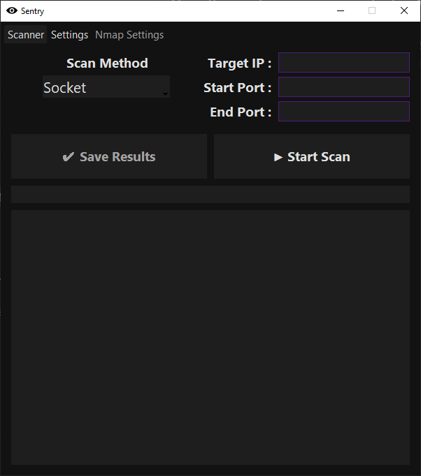

<p align="center">
  
</p>

<h1 align="center">Sentry</h1>
<p align="center"><strong>Fast, customizable, and lightweight GUI port scanner with support for Nmap and multithreading</strong></p>

---

## 📦 Installation

## ⚠ To get Nmap to work with the program you need to add it to PATH in windows, at the bottom of [This](https://nmap.org/book/inst-windows.html) page it tells you how to do this easily

```bash
git clone https://github.com/Ezi0-dev/sentry.git
cd sentry
pip install -r requirements.txt

python main.py
```

---

## 🚀 Features

- ⚙️ Choose scan method: Socket or Nmap
- 🎛️ Custom Nmap arguments supported through the GUI
- 🌙 Currently 3 themes to choose from `Dark`, `Light` and `Cold`
- 📤 Export scan results as `.txt`, `.csv`, or `.json` (Only works for Socket scanning!)
- 📈 Responsive progress-bar
- 🖥️ Clean and responsive GUI built with `tkinter`
- 💾 Settings stored in `settings.json`
- ⚡ Fast scanning (Depending on how many threads you want to use)
- 📃 Banner grabbing

---

## 🖼️ UI Preview



---

## Disclaimer

This tool is intended for **educational and ethical use only**.

Do **not** use it to scan targets that you do not own or have explicit permission to test. Unauthorized scanning is illegal and unethical. The developer is **not responsible for any misuse** of this tool.

Use responsibly. 🛡️


<details>
<summary>Old</summary>
<br>

Simple portscanner, no external downloads required.<br />
Use "portscannerold" if you dont want GUI<br />
<br />
### **Planned Features** :<br />

- [x] **Add Logo.** 🔅 <br />
- [x] **Add UDP scanning.** 🔍 <br />
- [x] **Add Themes** 🖍 <br />
- [x] **Add Option to allow user to change threads through GUI** 🦾 <br />
- [x] **Add Settings tab.** ⚙️ <br />
- [x] **Add Output to txt file.** 📃 <br />
- [x] **Added CSV and JSON output options.** 🗃 <br />
</details>
